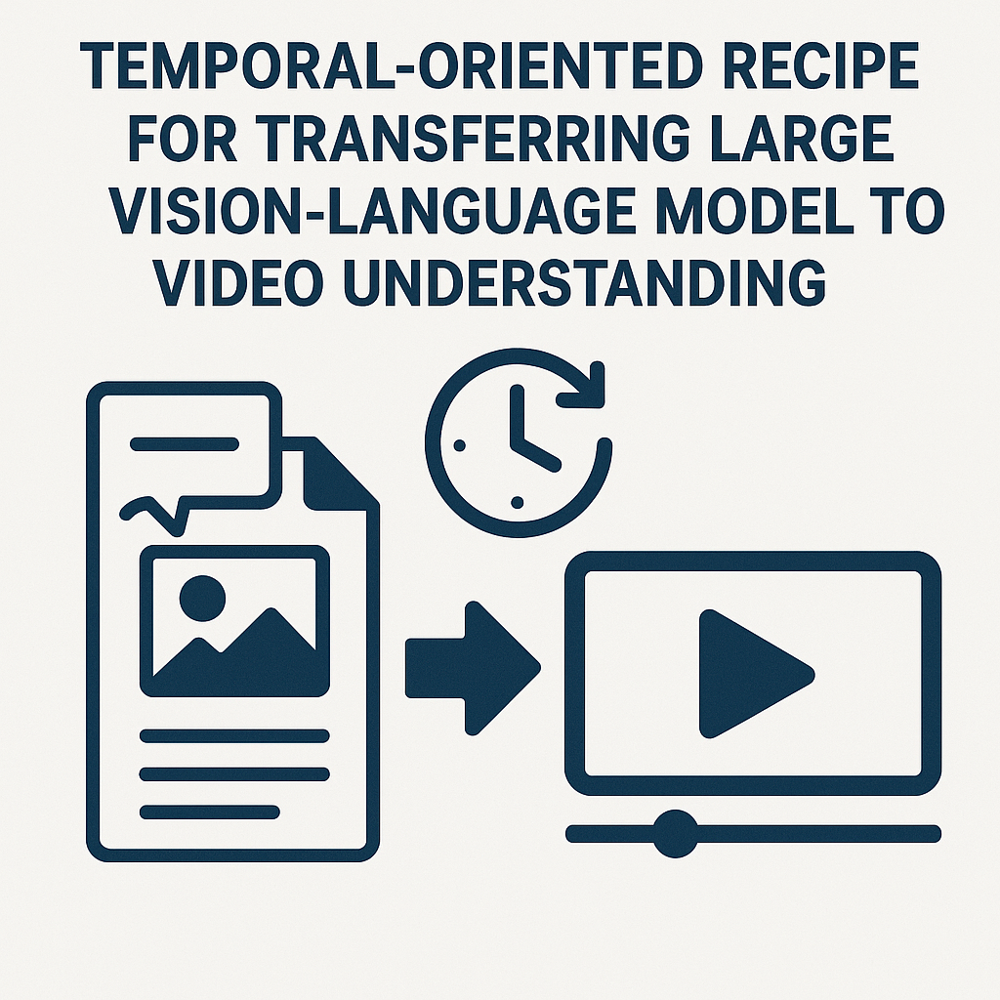

# Temporal Recipe

Temporal-Oriented Recipe for Transferring Large Vision-Language Model to Video Understanding

[Thong Nguyen](https://nguyentthong.github.io/), [Zhiyuan Hu](), [Xu Lin](), [Cong-Duy Nguyen](), [See-Kiong Ng](), [Luu Anh Tuan]()
